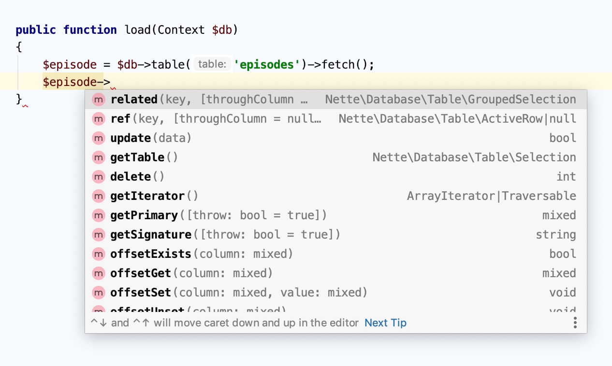
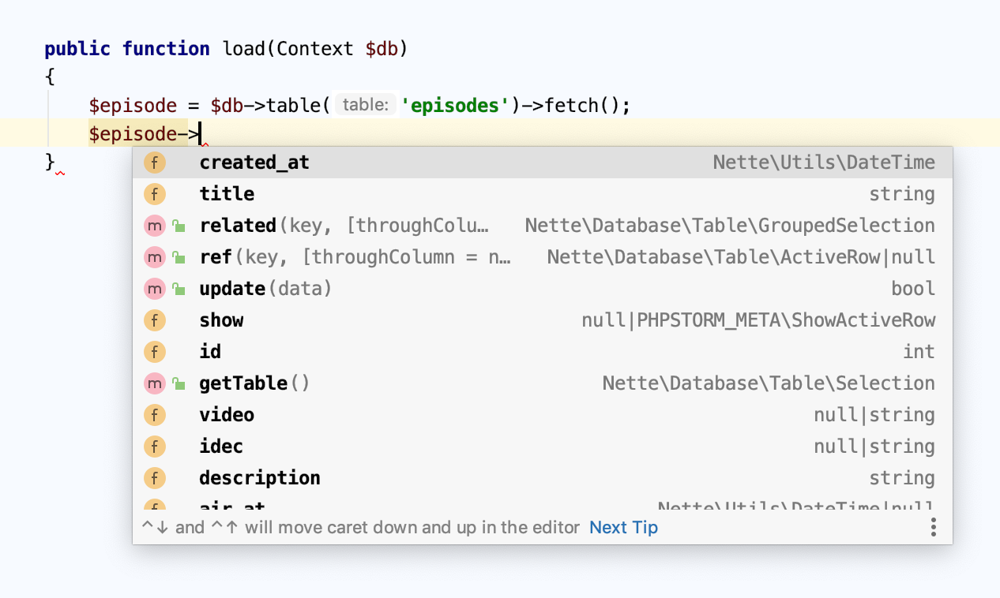

# PhpStorm meta generator
Simple application for generating meta files for PhpStorm


## Description
This application generates PhpStorm meta files for [nette/database](https://github.com/nette/database) ActiveRows based on database structure.

## Installation
`git clone git@github.com:lulco/phpstorm-meta-generator.git`
or
`git clone https://github.com/lulco/phpstorm-meta-generator.git`

`composer install`

## Usage
```
php bin/phpstorm-meta-generator nette:database [--bootstrap BOOTSTRAP] [--] <app-root>

Arguments:
    app-root                   Application root path
 
Options:
    --bootstrap=BOOTSTRAP      Path to bootstrap [default: "app/bootstrap.php"]`
```

Close and reopen project where PhpStorm meta have been generated. Now you can use autocompletion suggestions for ActiveRows

Before:


After:

